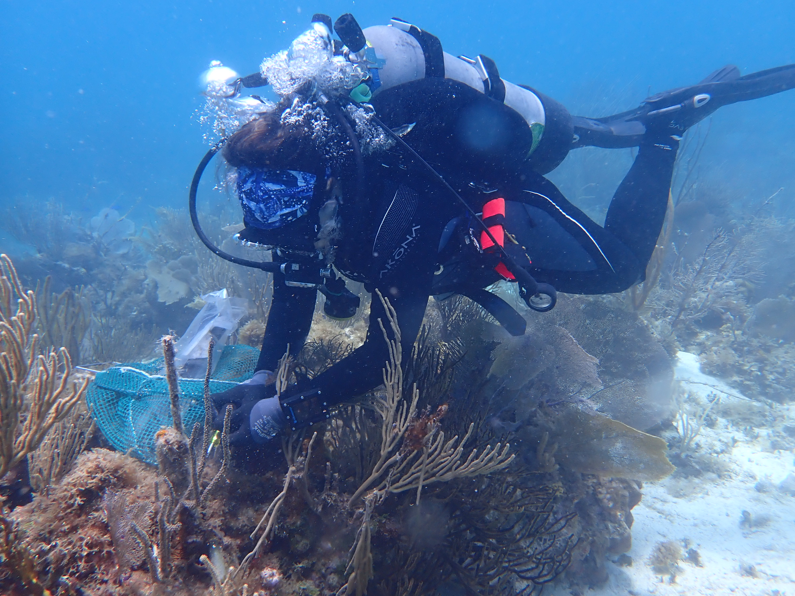

---
output:
  html_document:
    fig_height: 5
    fig_width: 5
    fig_position: center
  always_allow_html: true
  word_document: default
editor_options: 
  chunk_output_type: console
---

<h1 style="color: darkblue;font size=24, align=center" > National Coral Reef Monitoring Program</h1> 

<h2 style="color: darkblue;font size=12"> Climate Monitoring Brief: St. Thomas and St. John USVI</h2>
--------


```{r setup, include=FALSE}
knitr::opts_chunk$set(echo = FALSE,
                message = FALSE, warning = FALSE, 
                fig.align = "center")
options(htmltools.dir.version = FALSE)
```

 
```{r libraries, include=FALSE}
library(dplyr)
library(reshape)
library(tidyverse)
library(lubridate)
library(stringr)
library(fs)

library(plotly)
library(scales)
library(ggpubr)
library(RColorBrewer)
library(scales)
library(openair)
library(magick)
library(ggplot2)
library(cowplot)

library(knitr)

# Map
library(leaflet)

# Dynamic html to static
#install.packages("webshot")
library(webshot)
#webshot::install_phantomjs()
#library(PhantomJS)
```


```{r front, echo=FALSE, out.width = '75%', fig.cap="Diver surveying XX reef", fig.align='center'}



```

<br>

<h4 style="font size=8">
NOAA/Atlantic Oceanographic &amp; Meteorological Laboratory (AOML) Coral Program<br>
University of Miami Cooperative Institute of Marine and Atmospheric Studies (CIMAS)<br>
</h4>

<br>

<h5 style="font size=6">
N. Besemer, A. Palacio, T.Gill, M. Studivan, K. Simmons, I. Enochs - March 2024
</h5>

```{r logos, echo=FALSE, fig.align='left', out.width='20%'}
p1 <- ggdraw() + draw_image("Logos/AOML.jpg", scale = 1)
p2 <- ggdraw() + draw_image("Logos/CIMAS.png", scale = 0.9)

plot_grid(p1, p2)
```

 
--------

### Mission

The AOML Coral Program tracks the status and trends of coral reef ecosystems of the U.S. Atlantic and Caribbean as part of the National Coral Reef Monitoring Program (NCRMP). This summary brief provides an overview of the most recent climate monitoring efforts in St. Thomas and St. John (US Virgin Islands).


### Expedition summary

* The NCRMP Atlantic climate monitoring team recently traveled to St. Thomas and St. John from July 19th to July 29th, 2023
* 27 different sites were visited by four team members and collaborators completing a total of 68 dives. 

--------

### Data collection summary

```{r get Temp, include=FALSE}
# 1. Import all processed temperature data
read_plus <- function(flnm) {
  read_csv(flnm ) %>%
    mutate(filename = flnm)
}

# tbl_with_sources <-
#     list.files(pattern = "*.csv", 
#                full.names = T) %>% 
#     map_df(~read_plus(.))

STR_all <-
    list.files(path = "Data/STRs",
               pattern = "*.csv", 
               full.names = T, 
               recursive = TRUE) %>% 
    map_df(~read_plus(.)) 


STR_all <- STR_all %>%
      mutate_at("filename", str_replace, "Data/STRs/", "")

colmn<-c("Island","Transect", "Depth", "SN", "Tag", "Location")
STR_all <-
  tidyr::separate(
    data = STR_all,
    col = filename,
    sep = "_",
    into = colmn,
    remove = TRUE
  )

## Formatting
  STR_all$Transect[STR_all$Transect=="east"]<-"East"
  STR_all$Transect[STR_all$Transect=="west"]<-"West"
  STR_all$Transect[STR_all$Transect=="north"]<-"North"
  STR_all$Transect[STR_all$Transect=="south"]<-"South"
  STR_all$Transect<-factor(STR_all$Transect, levels = c(
                                      "North", "East","South","West"))


  STR_all$Depth[STR_all$Depth=="01m"]<-"1m"
  STR_all$Depth[STR_all$Depth=="05m"]<-"5m"
  STR_all$Depth<-factor(STR_all$Depth, 
                  levels = c("1m", "5m", "15m","25m"))
  summary(STR_all$Depth)

  STR_all$Site<-paste(STR_all$Island, STR_all$Transect, sep = " ")
  STR_all$Site<-factor(STR_all$Site, 
                levels = c("STT North", "STT West", "STT South",
                           "STJ West", "STJ South", "STJ East", "STJ North"))
  summary(STR_all$Site)
```

**Subsurface temperature**: Subsurface temperature recorders (STRs) were recovered and redeployed at all seven transects, each one composed by four depths (Fig. 1). In total, more than 7.7 million temperature observations were collected from 26 instruments (Table 1)
  
```{r Temp observations}
Cases_Loc_depth<-STR_all %>% count(Depth, Site,
                                  sort = FALSE)
Cases_Loc_depth<-as.data.frame(Cases_Loc_depth %>%
                   pivot_wider(names_from = Depth,
                   values_from = n))
Cases_Loc_depth$Total<-rowSums(Cases_Loc_depth[, c(2:5)], na.rm=TRUE)
#write.csv(Cases_Loc_depth, "FLK_results/0_SampleS_Region_zone.csv")

kable(Cases_Loc_depth,
      format.args = list(big.mark = ","),
      caption = "Table 1: Number of temperature observations collected by transect and depth")
```


```{r pH_and_temp_data, include=FALSE}
pH_file<-list.files(path="Data", pattern = "seafet", full.names = T)

pH <- read_csv(pH_file, col_types = cols()) %>%
    select(DateTime = `DateTime (UTC+00:00)`,
           pH = `Internal pH (pH)`,
           Temperature = `pH Temperature (Celsius)`) %>%
    mutate(DateTime = parse_date_time(DateTime, '%m/%d/%y %H:%M')) %>%
    #manual start/stop time of monitoring
    filter(DateTime >= as.POSIXct('2023-07-24 12:30:00', tz='UTC') &
         DateTime <= as.POSIXct('2023-07-27 17:30:00', tz='UTC')) %>%
    mutate(DateTime = with_tz(DateTime, 'America/Puerto_Rico'))
    summary(pH$DateTime)
```


```{r Current_data, include=FALSE}
# 2. Get current data
current_file <-list.files(path="Data", pattern = "tiltmeter", full.names = T)
  # Are there going to be more than one current file? 
  current <- read.csv(current_file, header = TRUE)
  summary(current)
  head(current)

  # current$date = ymd_hms(paste0(current$Date, current$Time), tz = "UTC")
  #current$date = ymd_hms(current$Timestamp.UTC, tz = "UTC")
  current$date = ymd_hms(current$DateTime, tz = "UTC")
  current <- current[, c("date","Speed..cm.s.","Heading..degrees.")]
  colnames(current) <- c("date","ws","wd")
  
  #manual start/stop time of monitoring
  current <- subset(current, date >= ymd_hms("2023-07-24 13:15:00") &
                     date <= ymd_hms("2023-07-27 16:45:00"))
  current$DateTime <- lubridate::with_tz(current$date,
                                         "America/Puerto_Rico")  
  summary(current$DateTime)
```

```{r PAR_data, include = FALSE}
# 3. Get the PAR data  
  light_file <-list.files(path="Data", pattern = "ecopar", full.names = T)
  light <- read_csv(light_file, col_types = cols()) %>%
          #mutate(DateTime = parse_date_time(DateTime, '%m/%d/%Y %H:%M:%S')) %>%
          mutate(DateTime = mdy_hms(`Datetime (AST)`, tz="America/Puerto_Rico")) %>%
          select(DateTime, `PAR (calc)`) %>%
          drop_na() %>%
          mutate(interval = 0:(nrow(.)-1) %/% 10) %>%
          group_by(interval) %>%
          summarise(DateTime = mean(DateTime),
                    PAR = mean(`PAR (calc)`),
                    sd = sd(`PAR (calc)`)) %>%
        select(-interval) %>%
  #manual start/stop time of monitoring
   filter(DateTime >= as.POSIXct('2023-07-24 09:15:00', tz='America/Puerto_Rico') &
          DateTime <= as.POSIXct('2023-07-27 12:45:00', tz='America/Puerto_Rico'))

  summary(light$DateTime)
```

```{r}
pH_count<-paste0("pH = ", nrow(pH), " observations")
#pH_count
current_count<-paste0("Current = ", nrow(current), " observations")
#current_count
light_count<-paste0("Light = ", nrow(light), " observations")
#light_count
```

**NCRMP Climate fixed sentinel site monitoring:** At Brewers Bay - 5m site, located in St. Thomas, short term instruments (72h) were deployed to  monitor daily fluctuations in:

  * **Current**: 303 observations
  * **pH**: 307 observations
  * **Light**: 301 observations
  * **Carbonate Chemistry**: 17 samples collected


<br>

**Habitat persistence:** Changes in bioerosion and accretion were monitored:

  * **Carbonate budget surveys**: Benthic cover, sponge, urchin, and parrotfish surveys	completed at six transects
  * **Bioerosion**: 70 Bioerosion Monitoring Units (BMUs) collected, 70 redeployed 
  * **Calcification**: 35 Calcification Accretions Units (CAUs) collected, 35 redeployed

<br>

```{r mapInfo, include=FALSE}
# Map information
    # Add info from the sampling stations
    stations <- read.csv("Data/STTSTJ_SitesGPS.csv", header = T)
    #head(stations)
    
    stations$Location<-as.character(stations$Location)
    stations$Depth<-paste(as.character(stations$Depth_M),"m")
    
    #stations$Site<-factor(stations$Site, levels = c(""))
    stations$Depth<-ordered(stations$Depth, 
                            levels = c("1 m", "5 m", "15 m", "25 m"))
    
    stations$Size[stations$Depth_M==1]<-5
    stations$Size[stations$Depth_M==5]<-4
    stations$Size[stations$Depth_M==15]<-3
    stations$Size[stations$Depth_M==25]<-2
    
    #summary(stations)
    kable(head(stations[, -5], format = "html"))

# Change color depending on type of data?

  # Create palette 
  #brewer.pal(n = 9, name = "Blues")
  #library(RColorBrewer)
  #my_blues <- c(brewer.pal(9, "Blues")[c(4,5,6,7,8, 9)])
  
  # Assigne it to Depth and locations
  pal.gen <- colorFactor(palette = "Blues",
                         domain = stations$Depth)
  brewer.pal(n=8, "Blues")

  pal.gen2 <- colorFactor(palette = "Blues",
                         domain = stations$Depth)
# Noth arrow
  #North <- "Data/North-Arrow.png"
  
  # myicon <- makeIcon( iconUrl = "Data/North-Arrow.png", 
  #                   iconWidth=30,
  #                   iconHeight=30)

```

```{r makeAmap, echo=FALSE, fig.width = 9, fig.height = 4, fig.align='center'}
map<-leaflet(stations, width = '850px') %>% 
  addTiles() %>%
  addProviderTiles(providers$Esri.WorldGrayCanvas) %>%
  
  addLegend(position = "bottomright",
            pal = pal.gen2, 
            values = ~Depth, opacity = 1) %>%
  addScaleBar(position = "topright") %>%

  fitBounds(lng1=-65.12, lat=18.45, lng2=-64.54, lat2=18.25)%>%
  
  addCircleMarkers(lng = ~Long, lat = ~Lat, 
                   stroke = F, 
                   radius = ~Size*2, 
                   fillOpacity = 1,
                   color = ~pal.gen(Depth),
                   label = ~Depth,
                   labelOptions = labelOptions(
                     noHide = F,
                     textOnly = TRUE,
                     style = list(
        "color" = "black"))) %>%

# Sub_regions
     addRectangles(
      lng1=-65.08, lat1=18.35,
      lng2=-65.08, lat2=18.35,
      opacity = 1,
      color = "gray",
      #color = "#F8766D",
      weight=2,
      fillColor = "transparent",
      label = "STT West",
      labelOptions = labelOptions(
                       noHide = T, direction = "top",
                       offset = c(0, 0),
                       textOnly = F)) %>%
    addRectangles(
          lng1=-64.98, lat1=18.31,
          lng2=-64.98, lat2=18.31,
          opacity = 1,
          color = "gray",
          #color = "#F8766D",
          weight=2,
          fillColor = "transparent",
          label = "STT South",
          labelOptions = labelOptions(
                           noHide = T, direction = "bottom",
                           offset = c(0, 0),
                           textOnly = F)) %>%
    addRectangles(
          lng1=-64.975, lat1=18.395,
          lng2=-64.975, lat2=18.395,
          opacity = 1,
          color = "gray",
          #color = "#F8766D",
          weight=2,
          fillColor = "transparent",
          label = "STT North",
          labelOptions = labelOptions(
                           noHide = T, direction = "top",
                           offset = c(0, 0),
                           textOnly = F))%>%
    addRectangles(
          lng1=-64.81, lat1=18.32,
          lng2=-64.81, lat2=18.32,
          opacity = 1,
          color = "gray",
          #color = "#F8766D",
          weight=2,
          fillColor = "transparent",
          label = "STJ West",
          labelOptions = labelOptions(
                           noHide = T, direction = "bottom",
                           offset = c(0, 0),
                           textOnly = F))%>%
    addRectangles(
          lng1=-64.73, lat1=18.30,
          lng2=-64.73, lat2=18.30,
          opacity = 1,
          color = "gray",
          #color = "#F8766D",
          weight=2,
          fillColor = "transparent",
          label = "STJ South",
          labelOptions = labelOptions(
                           noHide = T, direction = "bottom",
                           offset = c(0, 0),
                           textOnly = F))%>%
    addRectangles(
          lng1=-64.67, lat1=18.36,
          lng2=-64.67, lat2=18.36,
          opacity = 1,
          color = "gray",
          #color = "#F8766D",
          weight=2,
          fillColor = "transparent",
          label = "STJ East",
          labelOptions = labelOptions(
                           noHide = T, direction = "top",
                           offset = c(0, 0),
                           textOnly = F))%>%
    addRectangles(
          lng1=-64.77, lat1=18.37,
          lng2=-64.77, lat2=18.37,
          opacity = 1,
          color = "gray",
          #color = "#F8766D",
          weight=2,
          fillColor = "transparent",
          label = "STJ North",
          labelOptions = labelOptions(
                           noHide = T, direction = "top",
                           offset = c(0, 0),
                           textOnly = F))
map

# addControl(map, position="topright", 
#           html = '')

```

<font size="2"> **Figure 1:** Study sites and depths in St. Thomas and St. John USVI. All Study areas have 4 depth points associated with them except for the north transect of St. John XX THIS IS NOT TREU BASED ON THE PLOTTED DATA. </font>

-----

### Subsurface temperature

The temperatures that marine organisms experience are a function of local oceanographic conditions and vary with depth. To monitor subsurface temperature, seven transects were established around the two islands. Each transect consists of STRs at four depths (1, 5, 15, 25m; Fig.2). Temperature was measured using SeaBird Electronics Subsurface Temperature Recorders (STR)s that collected data at 5-minute intervals. The instruments are usually swapped every 3 years for data collection but the COVID - 19 pandemic delayed field work in 2020. Local contractors were hired to swap the instruments as travel was not allowed. Gaps exist in the data as not all instruments survived the extended deployment time. The full time series of data from 2017 - 2023 at all six locations and all four depths are provided to allow for temporal and spatial comparison of subsurface temperature.

```{r filter Temp, include=FALSE}
toDelete <- seq(1, nrow(STR_all), 2)
STR_all<-STR_all[ toDelete ,]

toDelete <- seq(1, nrow(STR_all), 2)
STR_all<-STR_all[ toDelete ,]

toDelete <- seq(1, nrow(STR_all), 2)
STR_all<-STR_all[ toDelete ,]
```

```{r Tempvariables, include=FALSE}
# Define limits for temperature and time
  globalMinDate <- min(STR_all$UTCDateTime)
  #globalMinDate <-as.POSIXct("2017-06-16 14:15:00", tz= "UTC")
  globalMinTemp <- min(STR_all$Temperature)
  globalMaxDate <- max(STR_all$UTCDateTime)
  globalMaxTemp <- max(STR_all$Temperature)

# Define breaks in the x axis
  if ((globalMaxDate-globalMinDate) > 365.25) {
    xWidth <- "12 months"
  } else {
    xWidth <- "2 months"
  }
```


```{r plot STRs, echo=FALSE, fig.width = 9.5, fig.height = 4}

plot1<-ggplot(data = STR_all) +
      geom_line(aes(x = ymd_hms(UTCDateTime), 
                    y = Temperature, colour=Depth),
                size=0.5) +
  
  theme_bw() +
  theme(#axis.title.x = element_blank(),
        panel.grid = element_blank(),
        #legend.position = c(0.5, 0.95),
        legend.position = "top",
        legend.direction = "horizontal" ,
        plot.margin = unit(c(5.5, 5.5, 5.5, 5.5), "points"),
        legend.title = element_blank(),
        #legend.box.background = element_rect(colour = "black")
        ) +
  #scale_color_brewer(palette="Blues")+
  scale_color_manual(
    values=c("#DEEBF7", "#9ECAE1", "#4292C6","#084594"))+

  scale_x_datetime(breaks = breaks_width(xWidth),
                   labels = date_format("%m/%y"),
                   limits = c(globalMinDate, globalMaxDate),
                   name="Date",
                   expand = c(0.01, 0.01)) +
  scale_y_continuous(limits = c(globalMinTemp, globalMaxTemp),
                     name=(expression(paste("Temperature (", 
                                            degree, "C)"))),
                     breaks = seq(0, 50, 2)) +
  guides(colour = guide_legend(override.aes = list(size = 8)))+
  theme(legend.key=element_rect(fill=NA)) +
  facet_grid(Site~.)
#plot1

box1 <- ggplot(data = STR_all) +
       geom_boxplot(aes(x = Depth, y = Temperature, fill=Depth)) +
       theme_bw() +
       theme(panel.grid = element_blank(),
             axis.text.y = element_blank(),
             #axis.title.x = element_blank(),
             axis.title.y = element_blank(),
             legend.position = "top")+
      
  scale_y_continuous(limits = c(globalMinTemp, globalMaxTemp),
                     breaks = seq(0,50, 2))+
  #scale_fill_brewer(palette="Blues")+
  scale_fill_manual(
    values=c("#DEEBF7", "#9ECAE1", "#4292C6","#084594"))+
  facet_grid(Site~.)
#box1

Figure2_1 <- ggarrange(plot1, box1, widths = c(8/10, 2/10))
```

```{r, echo = F, fig.width = 9.5, fig.height = 6}
Figure2_1
```

<font size="2"> **Figure 2:** Temperature conditions at seven locations in St. Thomas and St. John (Savana, Inner Brass, Brewers Bay and Southwaters, Stevens Cay, Johnson's Reef, Tektite) representing a depth gradient (1m, 5m, 15m and 25m). Data were collected from August 2017 to July 2023. </font>
 
```{r, echo = F, include=F}

STR_all$MonthYear<-format(STR_all$UTCDateTime, format="%Y-%m")
STR_all$Month<-format(STR_all$UTCDateTime, format="%m")

STR_all_summary1 <- STR_all %>%
  group_by(Month) %>%
  summarise(
    MeanT = mean(Temperature, na.rm = T),
    MinT = min(Temperature, na.rm = T),
    MaxT = max(Temperature, na.rm = T)
  ) %>%
  arrange(Month)
STR_all_summary1

STR_all_summary <- STR_all %>%
  group_by(Site, Depth) %>%
  summarise(
    MeanT = mean(Temperature, na.rm = T),
    MinT = min(Temperature, na.rm = T),
    MaxT = max(Temperature, na.rm = T)
  ) %>%
  arrange(Site)
STR_all_summary

STR_all_summary2 <- STR_all %>%
  group_by(Site, Depth) %>%
  summarise(
    MinD = min(UTCDateTime, na.rm = T),
    MaxD = max(UTCDateTime, na.rm = T)
  ) %>%
  arrange(Site)
STR_all_summary2

```

Mean temperature values were similar among the locations and depths. The lowest temperatures generally occurred in February (mean: 26.3$^\circ$C, min: 25.0$^\circ$C, max: 28.9$^\circ$C) and the highest temperatures in September (mean: 29.3$^\circ$C, min: 27.1$^\circ$C, max: 32.0$^\circ$C). Temperature in the shallower transects (1m at STT South and STJ South) was more variable compared to deeper transects (5, 15 and 25m; Fig. 2). 

-----

### Diurnal suite deployment

Seawater carbonate chemistry can fluctuate diurnally, due to biological forcing processes	such as	photosynthesis and respiration, as well as	calcification and dissolution. To characterize	this, discrete	water	samples (Fig. 3) were collected at three-hour intervals (n=15) using Subsurface Automatic Samplers (SAS, www.coral.noaa.gov/accrete/sas).

These samples will be analyzed for Total Alkalinity (TA), Dissolved Inorganic Carbon (DIC), and SpectrophotometricpH (SpecpH), which	will be	used	to	calculate	pCO2	and	aragonite	saturation state	(ΩAragonite).	A	suite	of instruments was deployed for a 72-hour period	at the Brewers Bay 5m site. A SeaFET was used to log pH, an EcoPAR	measured Photosynthetically Active Radiation (PAR), and	a Lowell Tiltmeter measured	current speed	and	direction. Each	collected measurements at 15-minute intervals (Fig. 3).

```{r ph and temp combined v3,echo=FALSE, warning=FALSE,fig.width = 9.5, fig.height = 3.5}

#pH and temp combined 
summary(pH)

# Scale Temperature 
  #pH$Temp.adj <- (pH$Temperature * 0.3) -1.42
  
  scaleFactor_T <- max(pH$pH) / max(pH$Temperature)
  pH$Temp.adj<-(pH$Temperature * scaleFactor_T)-0.2
  summary(pH)

  Temp.adj_max <- max(pH$Temp.adj)
  pH_max <- max(pH$pH)
  
# Plot
pH_Temp_Plot<-ggplot(data = pH) +
  # Day/Night
  annotate("rect",
          xmin = seq.POSIXt(as.POSIXct('2023-07-24 18:56:00', tz='America/Puerto_Rico'),
                         by = "day", length.out = 3),
          xmax = seq.POSIXt(as.POSIXct('2023-07-25 05:55:00', tz='America/Puerto_Rico'),
                         by = "day", length.out = 3),
          ymin = -Inf, ymax = Inf,
          fill="grey", alpha=0.5) +
  
   annotate("text",
          label = paste("July", 24:27),
          x = seq.POSIXt(as.POSIXct('2023-07-24 11:30:00', tz='America/Puerto_Rico'),
                         by = "day", length.out = 4),
          y = pH_max + 0.03)+ 
  # Data
  geom_line(aes(x=DateTime, y=Temp.adj, color = "Temperature"),
            size=0.8) +
  geom_line(aes(x=DateTime, y=pH, color = "pH"),
            size=0.8) +
  scale_color_manual(values=c("black", "red"))+
  # Axes
  scale_y_continuous(limits = c(7.36, 8),
                     name="pH (Total scale)",
                     sec.axis = sec_axis(~(.+0.2)/scaleFactor_T,
                                name="Temperature (\u00B0C)"))  +
  scale_x_datetime(name="Date and Time (AST)",
                  date_breaks = "6 hour",
                  #date_minor_breaks = "1 hour",
                  labels = date_format("%m/%d\n%H:%M",
                                        tz="America/Puerto_Rico"))+
  coord_cartesian(ylim = c(7.36, 8),
                  xlim = c(min(pH$DateTime),max(pH$DateTime)),
                  clip = 'off',
                  expand = T) +
  #Aesthetics
  theme_bw() +
  theme(#axis.text.x = element_text(angle = 0, hjust = 0.5),
        plot.margin = unit(c(1,1,0.5,1), "lines"),
        legend.position = "none",
        panel.grid = element_blank(),
        axis.title.x=element_blank(), 
        axis.text.x=element_blank(),
        legend.key=element_rect(fill=NA), axis.title.y.right = element_text(vjust = .75))+
  guides(colour = guide_legend(override.aes = list(size = 8)))

#pH_Temp_Plot
 
```

```{r light and current compbined,echo=FALSE, warning=FALSE,fig.width = 9.5, fig.height = 3.5}

# Scale current
scaleFactor <- max(light$PAR) / max(current$ws)
current$ws.adj<-(current$ws * scaleFactor)
summary(light)
summary(current)

# Plot
Light_Current<-ggplot(data = light) +

  # Day/Night
annotate("rect",
          xmin = seq.POSIXt(as.POSIXct('2023-07-24 18:56:00', tz='America/Puerto_Rico'),
                         by = "day", length.out = 3),
          xmax = seq.POSIXt(as.POSIXct('2023-07-25 05:55:00', tz='America/Puerto_Rico'),
                         by = "day", length.out = 3),
          ymin = -Inf, ymax = Inf,
          fill="grey", alpha=0.5) +
  
  # Data
  geom_line(data= current, aes(x=date, y=ws.adj, color = "Current Speed"),
            size=0.8) +
  geom_line(aes(x=DateTime, y=PAR, color = "PAR"),
            size=0.8) +
  scale_color_manual(values=c("navyblue", "goldenrod1"))+
  
  # Axes
  scale_y_continuous(limits = c(0,743), 
                     name=expression(paste("PAR (",mu,"mol photons m"^-2,"s"^-1,")")),
                     sec.axis = sec_axis(~./scaleFactor, 
                                name="Current Speed (cm/s)",
                                breaks = seq(1,12,2)))+
                       
  scale_x_datetime(name="Date and Time (AST)",
                   date_breaks = "6 hour",
                   #date_minor_breaks = "1 hour",
                   labels = date_format("%m/%d\n%H:%M",
                                        tz="America/Puerto_Rico")) +

  coord_cartesian(ylim = c(0,743),
                  xlim = c(min(light$DateTime),max(light$DateTime)),
                  clip = 'off',
                  expand = T) +
  
  #Aesthetics
  theme_bw() +
  theme(axis.text.x = element_text(angle = 0, hjust = 0.5),
          plot.margin = unit(c(0.5,1,0.1,1), "lines"),
          legend.position = "none",
          panel.grid = element_blank(),
        legend.key=element_rect(fill=NA)
        )+
  guides(colour = guide_legend(override.aes = list(size = 8)))
#Light_Current

```


```{r Diurnal_Suite_Plot, echo=FALSE, warning=FALSE, fig.width = 9.5, fig.height = 7}
Legend1<-pH_Temp_Plot + theme(legend.position = "bottom",
                              legend.title = element_blank())
  Legend1<-get_legend(Legend1)
  #ggdraw(Legend1)

Legend2<-Light_Current + theme(legend.position = "bottom",
                              legend.title = element_blank())
  Legend2<-get_legend(Legend2)
  #ggdraw(Legend2)
  
ggdraw(plot_grid(plot_grid(pH_Temp_Plot,
                           Light_Current,
                           ncol=1, align='v', 
                           rel_heights = c(0.9, 1)),
                 plot_grid(Legend1, Legend2, ncol=2), 
                 ncol = 1, rel_heights=c(1, 0.1)))
```

<font size="2">**Figure 3:** Data	from Brewers Bay diurnal suite monitoring from July 24th to July 27th. Top panel: pH and	temperature from SeaFET. Bottom panel: Photosynthetically	Available	Radiation (PAR)	and current speed from EcoPAR and Tiltmeter. Shading denotes nighttime throughout	sequence of the plot. Instruments measured parameters every 15 minutes. </font>

-----

### Habitat persistance

**Carbonate budget** assessments use transect-based surveys (Reef Budget) to quantify the abundance of carbonate producers (e.g., Corals and Crustose coralline algae), and carbonate bioeroders, (e.g., parrotfish and sea urchins). Abundances are multiplied by taxon-specific rates of carbonate alteration to determine if a reef is in a state of net accretion (habitat growth) or net loss (habitat loss; Fig. 4). At Brewers Bay, six transects were surveys in 2017 and 2023 to obtain carbonate budgets. These data show stable carbonate production over the monitoring time points. The transect results showed positive carbonate budgets in 2017 and 2023, which implies that this site supported reef accretion over the past eight years. However, carbonate production significantly declined from 5.08 +- 1.78 sd kg m-2 yr-1 in 2017 to 1.33 +- 1.78sd kg m-2 yr-1. This change was mainly driven by a reduction in coral production from 6.90 +- 2.13 in 2017 to 1.98 +- 0.326 in 2023.

```{r, Carbonate_B_plot, echo=FALSE, warning=FALSE, fig.width = 7.5, fig.height = 3.5}

CB.data<- read.csv("Data/UV_BC.csv")
CB.data$Macroalgae.cover<-NULL
CB.data$Turf.cover<-NULL
CB.data$Coral.cover<-NULL
CB.data$CCA.cover<-NULL

CB.data.A<-melt(CB.data,id.vars=c(8:9))
CB.data.A$Year<-as.character(CB.data.A$Year)
CB.data.A[c(3)] <- lapply(CB.data.A[c(3)], gsub, pattern = ".", replacement = " ", fixed = TRUE)
CBA.data<-subset(CB.data.A,variable=="Carbonate budget")

CB_A_plot<-ggplot(CBA.data, aes(Year, value, fill=Year))+
  geom_abline(slope = 0, intercept = 0, colour="gray")+
  geom_boxplot(alpha=0.5,width=0.4)+
  scale_fill_manual(values=c( "#666699","#336666","#996666")) +
  facet_wrap(~variable)+
  geom_jitter(colour="black",size=1,alpha=0.9,shape=1,width=0.15)+
  theme_bw()+
  theme(panel.grid.major = element_blank(),
        panel.grid.minor=element_blank(),
        legend.position = "none")+
  ylab(expression(paste("Carbonate production (kg m"^"-2"," yr"^"-1",")")))
  


mdata<-melt(CB.data,id.vars=c(1,8:9))
mdata$Year<-as.character(mdata$Year)
mdata[c(4)] <- lapply(mdata[c(4)], gsub, pattern = ".", replacement = " ", fixed = TRUE)
mdata$variable <- factor(mdata$variable, 
                         levels = c("Coral production","CCA production",
                                    "PF bioerosion", "Urchin bioerosion", 
                                    "Macrobioerosion","Microbioerosion"))
CB_B_plot<-ggplot(mdata,aes(Year,value,fill=Year))+
  geom_boxplot(alpha=0.5,width=0.5)+
  scale_fill_manual(values=c( "#666699","#336666", "#996666")) +
  geom_jitter(colour="black",size=1,alpha=0.9,shape=1,width=0.15)+
  facet_wrap(~variable,scales="free",ncol=3) +
  theme_bw()+
  theme(panel.grid.major = element_blank(),
        panel.grid.minor=element_blank(),
        legend.position = "none")+
   ylab(expression(paste( "")))
  #ylab(expression(paste( " [ kg m"^"-2"," yr"^"-1","]")))

ggarrange(CB_A_plot, CB_B_plot, 
          #labels = c("A", "B", "C"),
          ncol = 2, nrow = 1, widths = c(1, 2))

CB.summary <- CBA.data %>%
  group_by(Year) %>%
  summarise(
    Mean = mean(value, na.rm = T),
    sd = sd(value, na.rm = T)
  ) %>%
  arrange(Year)
#CB.summary

CBCoral.summary <- CB.data %>%
  group_by(Year) %>%
  summarise(
    Mean = mean(Coral.production, na.rm = T),
    sd = sd(Coral.production, na.rm = T)
  ) %>%
  arrange(Year)
#CBCoral.summary
```

<font size="2">**Figure 4:** Net carbonate production and the magnitude of carbonate alteration by calcifying or bioeroding functional groups. PF represents parrotfish. The scale of the y-axis varies for each functional group </font>

-----

**Calcification Accretion Units (CAUs)** and **Bioerosion Monitoring Units (BMUs)** were used to investigate the balance between	calcification	and erosion. CAUs	and	BMUs were collected and redeployed for the next sampling cycle. CAUs are processed by the NCRMP Pacific Climate group	and	the data will be available within a year. BMUs will be dried and cleaned using a hydrogen peroxide solution. Samples	will be	weighed and scanned using a CT scanner and then compared to their pre-scans	to quantify	bioerosion.

**Landscape mosaics** are used to quantify the benthic community, and to monitor changes in coral cover over time. Thousands of underwater images are digitally stitched together to create a high-resolution archive of the reef at the time of collection.


```{r front, echo=FALSE, out.width = '75%', fig.cap="Figure 5: Landscape Mosaic collected from transect XX", fig.align='center'}

knitr::include_graphics("Data/Pictures/stt_July23_T1_Mosaic.tiff")

```

-----

### About the monitoring program

AOML's climate monitoring is a key part of the National Coral Reef Monitoring Program of NOAA's Coral Reef Conservation Program (CRCP), providing integrated, consistent, and comparable data across U.S. Managed coral reef ecosystems.
NCRMP monitoring efforts aim to:

* Document the status of reef species of ecological and economic importance
* Track and assess changes in reef communities in response to environmental stressors or human activities
* Deliver high–quality	data, data products, and	tools to	the	coral	reef	conservation	community


### Point of Contact

Atlantic Climate team lead: nicole.besemer@noaa.gov

Principal Investigator: ian.enochs@noaa.gov

NCRMP Coordinator: erica.towle@noaa.gov


### For more information

Coral Reef Conservation Program: http://coralreef.noaa.gov

NCRMP climate monitoring: https://www.coris.noaa.gov/monitoring/climate.html

NOAA Atlantic Oceanographic and Meteorological Laboratory:
http://www.aoml.noaa.gov/

[U.S. Virgin Islands Reef Status Report 2020](https://www.coris.noaa.gov/monitoring/status_report/docs/USVI_508_compliant.pdf)

[National Coral Reef Status Report 2020](https://repository.library.noaa.gov/view/noaa/27295)

### Acknowledgements


These efforts were jointly funded by NOAA's CRCP project #743 and OAP. We would like to sincerely thank the University of the Virgin Islands particularly Dr. Tyler Smith and his team, Sarah Heidmann, Lindsay Dade, Nicole Krampitz, Adeline Shelby and Erin Hollander for all of the mission support we received for the trip. 

```{r fundingsources, include=FALSE, fig.width = 10, fig.height = 4, fig.align='center', out.width='100%'}

F1 <- ggdraw() + draw_image("Logos/CRCP.jpeg", scale = 0.5)
#F_space<-ggplot() +
#    theme_void() +
#    geom_text(aes(0,0,label='')) +
#    xlab(NULL)
F2 <- ggdraw() + draw_image("Logos/OAP.png", scale = 1.1)
F3 <- ggdraw() + draw_image("Logos/UPRlogo.png", scale = 0.7)
F4 <- ggdraw() + draw_image("Logos/UVI_logo_bw_300_3x.jpeg", scale = 0.5)

funding<-plot_grid(F1, F2, F3, F4,
                  nrow=1, rel_widths = c(2, 2, 2, 2))

```


```{r funding, echo=FALSE,fig.width = 10, fig.height = 3, fig.align='center', out.width='100%'}
funding
```


**XXX Field Team**: XXX

**AOMLs NCRMP Atlantic and Caribbean Climate Team**: I. Enochs, N. Besemer, A. Palacio-Castro, G. Kolodziej, T. Gill, A.Boyd, M. Jankulak, K. Simmons, A. Webb, B. Chomitz
